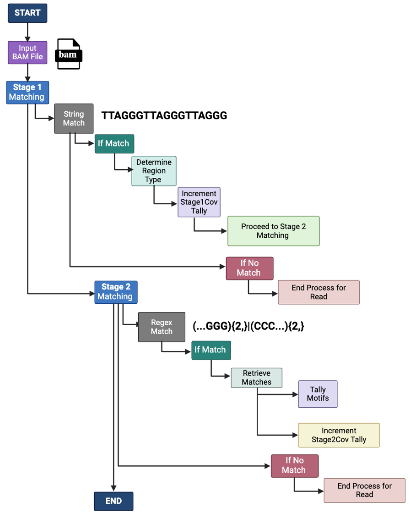

# TeloTales: Telomere Content Analysis Pipeline

This repository presents a reproducible bioinformatics pipeline for estimating telomere content from whole-genome sequencing (WGS) data from the 1000 Genomes Project. The workflow includes automated retrieval of BAM/BAI files, extraction of telomeric repeat signals using qmotif, and downstream analysis of telomere content across samples.

Data are accessed directly from [the 1000 Genomes Project via NCBI](https://www.ncbi.nlm.nih.gov/projects/faspftp/1000genomes/), and are not stored within this repository.

We utilized [NCBI’s 1000 Genomes Project server](https://www.ncbi.nlm.nih.gov/projects/faspftp/1000genomes/).

## Table of Contents
* [Requirements](#requirements)
* [File Descriptions](#file-descriptions)
* [Usage](#usage)
* [Detailed Steps](#detailed-steps)
* [Outputs](#outputs)
* [Citation](#citation)
* [Contact](#contact)

## Requirements
To run this pipeline, you'll need:

* **Java**: Required to run qmotif
* **qmotif**: Download and install qmotif ([Documentation here](https://adamajava.readthedocs.io/en/latest/qmotif/qmotif_1_0/))

<!--  -->


**Supplementary Figure 1. Workflow for Telomere Content Variation Pipeline.**
Schematic representation of the qmotif-based pipeline used to estimate telomere content variation across samples from Phase 3 of the 1000 Genomes Project. The workflow involves extracting and quantifying telomeric reads from whole-genome sequencing data using qmotif v1.0. The tool operates through a two-stage matching system: in Stage 1, a simple string match is used to identify canonical telomeric repeats, while in Stage 2, a more complex regular expression is applied to detect variant telomeric sequences. At the end of Stage 2, a tally of all identified motifs is done, and the final number is recorded. [Figure created with BioRender.com].

**Additional files to prepare:**
* `files_list.txt`: Contains URLs of BAM and corresponding BAI (BAM index) files from the 1000 Genomes Project
* `chrnames.txt`: Contains chromosome names for tallying telomeric reads

## File Descriptions
* **download_files.sh**: Bash script to download BAM and BAI files from Phase 3 of the 1000 Genomes Project using `files_list.txt`

* **runqmotif.py**: Python script to run qmotif on BAM files to analyze telomere content
* **stage2.py**: Python script to parse `log.txt` files generated by runqmotif.py to extract telomere read counts by chromosome
* **realcoverage.sh**: Bash script to tally telomere reads by chromosome; uses `chrnames.txt` file
* **scaledgenomic.sh**: Bash script to parse `output.txt` files generated by runqmotif.py to extract scaled telomeric reads for each sample

## Usage
## Sequence of Execution
To use the pipeline, run the scripts in the following order:
1. `download_files.sh` (requires: `files_list.txt`)

2. `runqmotif.py` (requires: BAM and BAI files, generates: `log.txt` and `output.txt` files)

3. `stage2.py` (requires: `log.txt` files generated by `runqmotif.py`)

4. `realcoverage.sh` (requires: `chrnames.txt` file; generates: `output_coverage_filenames`, `stage2coverage`)

5. `scaledgenomic.sh` (requires: `output.txt` files generated by `runqmotif.py`; generates: `ScaledGenomicOutput.txt`)

* **Download Recommendations**: For optimal performance when downloading these files, we recommend using an HPC or a Linux-based system. Due to the large file sizes, these systems tend to handle extensive downloads more reliably and efficiently than some alternatives. Additionally, we suggest ensuring a stable internet connection to minimize interruptions during the download process.

* **Note**: When working with long-running processes, such as data analysis scripts or large data transfers, it’s often helpful to use tools like `tmux` and `nohup` to keep the process running even if your session disconnects. Documentation on [tmux](https://github.com/tmux/tmux/wiki) and [nohup](https://phoenixnap.com/kb/linux-nohup) available here.

## Detailed Steps
1. **Download BAM and BAI files**
* Run `download_files.sh` to download the BAM and BAI files from NCBI’s 1000 Genomes Project server. Make sure to:
* Include URLs for BAM and BAI files in `files_list.txt` and that both `download_files.sh` and `files_list.txt` are in the same folder.

```
chmod +x download_files.sh
```

```
./download_files.sh
```
**OR**

```
bash download_files.sh
```

2. **Run qmotif with runqmotif.py**
* Before running runqmotif.py, ensure qmotif is installed, and the path to qmotif and your BAM and BAI input files is set.

```
python3 runqmotif.py
```

3. **Parse qmotif Log Files**
* Use `stage2.py` to parse log files created by `runqmotif.py`. This script will output telomere read counts for each chromosome in a file named `{sequence_name}_stage2_coverage.txt`.

```
python3 stage2.py
```

4. **Generate Chromosome-Level Tally of Telomeric reads**
* Run `realcoverage.sh` to tally telomeric reads for each chromosome. This script uses the `chrnames.txt` file, so make sure it’s in the same folder. 
* **Note**: The `chrnames.txt` file only has chromosome numbers for autosomes; sex chromosomes are not included.

```
bash realcoverage.sh
```

5. **Extract Scaled Telomeric Reads for all the samples**
*  Run `scaledgenomic.sh` file to extract scaled telomeric reads data from output files created by `runqmotif.py`. This generates a file named `ScaledGenomicOutput.txt`.

```
bash scaledgenomic.sh
```

## Outputs

* `{sequence_name}_stage2_coverage.txt`: Chromosome-specific telomeric read counts (output of `stage2.py`)
* `stage2coverage`: Combined telomeric read counts for each chromosome across all sequences (output of `realcoverage.sh`)
* `ScaledGenomicOutput.txt`: Scaled telomeric reads for all the sequences
* `output_coverage_filenames`: This file lists all files ending with `_coverage.txt`(output of `realcoverage.sh`)
*  Example output files generated by the **qmotif** tool are included in the `supplementary_data` directory. These files serve as reference outputs to understand the results produced by the qmotif analysis process.


## Help
* There are example output files generated from all the scripts in the "supplementary data" folder. 

## Citation
* If you use TeloTales, please cite our [paper](https://www.biorxiv.org/content/10.1101/2025.11.03.686324v1)
```
Shah, P., & Sethuraman, A. (2025). A Comprehensive Catalog of Telomere Content Variation across Human Populations. https://doi.org/10.1101/2025.11.03.686324 

```

## Contact
* If you’d like to discuss this project or get in touch for other inquiries, please email me at priyanshishah213@gmail.com or connect with me on [LinkedIn](https://www.linkedin.com/in/priyanshi-p-shah/). 
